<h5>Nome: Susana e Kauan | Turma:2ºJogos | Turma B </h5>

# GIT BASH

##### Ao abrir o google, digite github na aba de pesquisa.

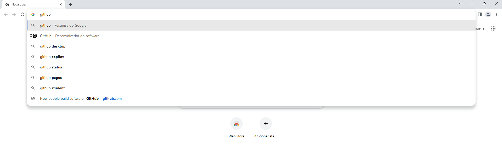

 
<h5>Após abrir o site do git hub, clique na parte superior esquerda em "sign in" caso já tenha uma conta, caso não tenha, clique em "sing up". Supondo que você tenha uma conta criada no git hub, essa tela de login irá aparecer:</h5>

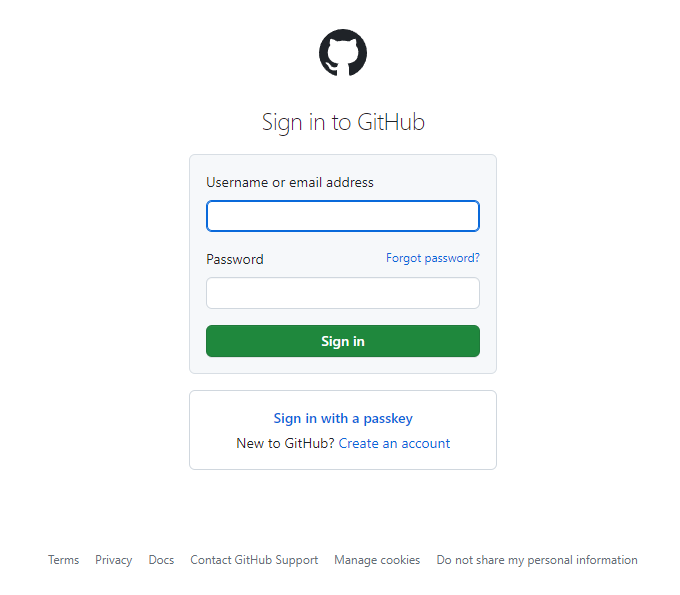

 
<h5>Em sua página inicial do git hub, para que você possa criar um novo repositório, clique em "create repository".</h5>

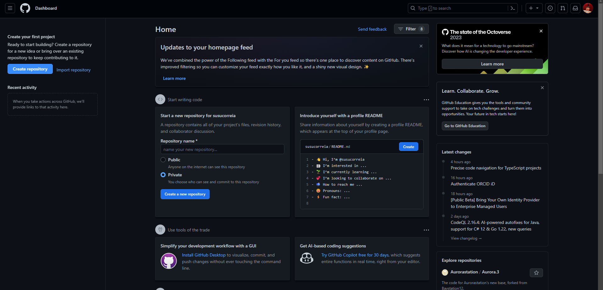

 
<h5>Essa é a página que será apresentada a você:</h5>

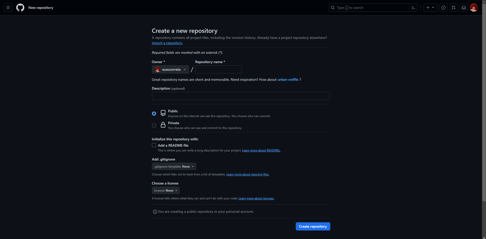
<h5>-> Preencha as informações a respeito de seu repositório, se lembre de deixar em público e de que o nome de seu repositório precisa ser dado sem espaços.</h5>

 
<h5>Para adicionar um colaborador à seu repositório, entre em seu repositório e clique em "settings"</h5>

 
<h5>Em seguida clique em "collaborators"</h5>

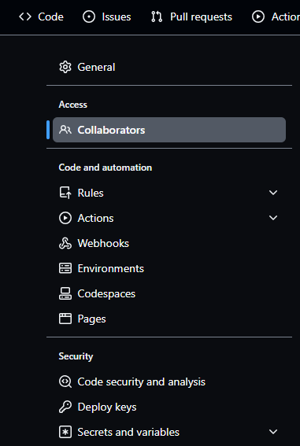

 
<h5>Para adicionar um colaborador, clique em "add pepople"</h5>

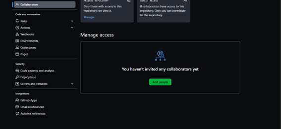

 
<h5>Digite o nome de usuário ou o email do colaborador que você quer adicionar nesse local:</h5>

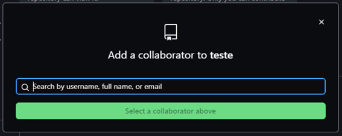

 
<h5>Após entrar no Git Bash, digite "git init" para iniciar seu repositório.</h5>

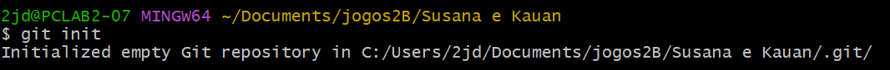

 
<h5>Após iniciar seu repositório é necessário configurá-lo, começando pelo comando "git remote add origin https://github.com/username/nome_repositorio" que associa o repositório ao servidor</h5>

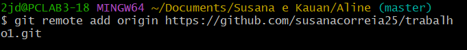
<h5>-> Para utilizar esse comando é necessário ter o link do repositório, que pode ser conseguido ao clicar em "code" na parte principal do repositório online.</h5>

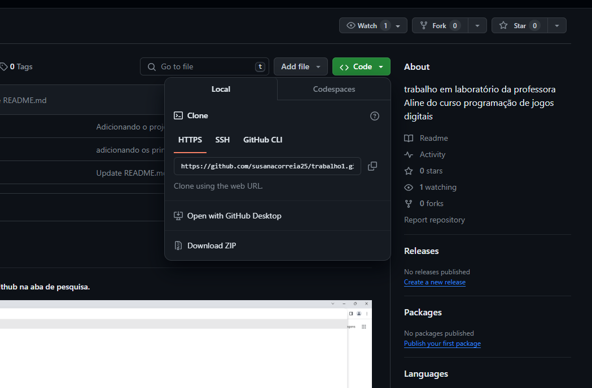

 
<h5>Após ter associado seu repositório ao servidor, renomeie sua branch Master para Main, com o seguinte comando: "git branch -m main"</h5>

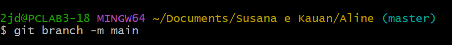

 
<h5>Em seguida, utilize o comando "git add ." para adicionar todos os arquivos em uma lista de arquivos a serem monitorados.</h5>

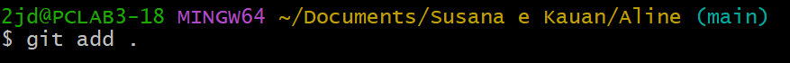

 
<h5>Após ter adicionado todos os arquivos, utilize o comando "git commit -m ("comentário das alterações")" para comentar sobre as alterações realizadas e criar um ponto de referência com o estado atual de todos os arquivos.</h5>

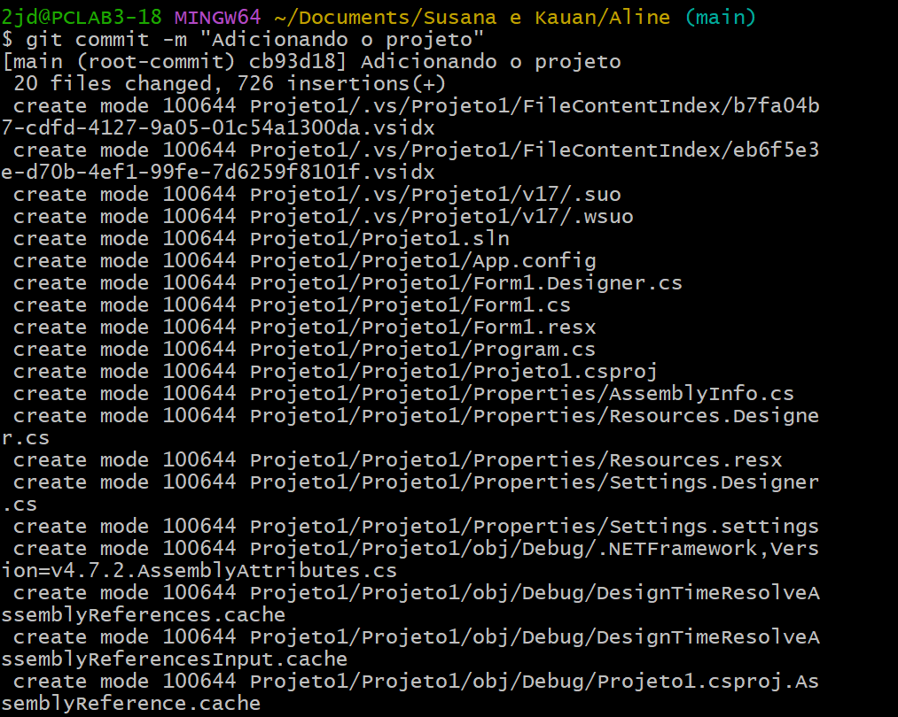

 
<h5>Em sequência, digite o comando "git pull --allow-unrelated-histories https://github.com/username/nome_repositorio" para buscar modificações no servidor e mesclar a versão local com as alterações remotas.</h5>

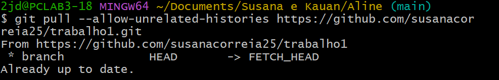

 
<h5>Após tudo isso, você estará apto para utilizar o comando "git push --set-upstream origin main" que vai enviar as alterações locais para o servidor remoto e configurar a branch main como padrão, o que significa que para futuros "git push" o git entenderá que você quer enviar para a branch "main" no repositório remoto chamado "origin".</h5>

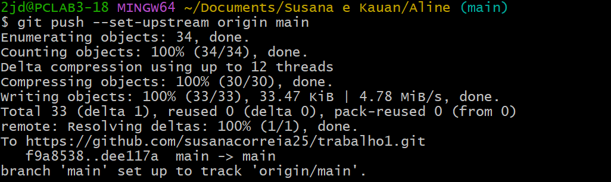
